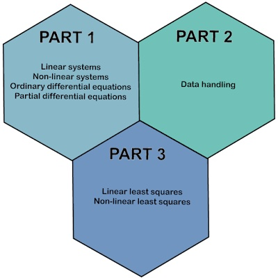

# CH3133: Numerical Practicum 2022 - Current Overview

Course description follows.


## Section 1/: Overview of the First Quarter 

1. Python Programming Language - Week 1 
- Numpy: 100 exercises in two teams subdivided in subteams 
- Scipy and Sympy: 
- Homework exercises 
2. HW1: Preliminaries - Week 2 and Week 3 - 1 ECTS 
- [Recap/Intro of Prerequisites Part (1/3)](homework1/notebooks/HW1-intro-part1of3.ipynb) 
- [Recap/Intro of Prerequisites Part (2/3)](homework1/notebooks/HW1-intro-part2of3.ipynb) 
- [Recap/Intro of Prerequisites Part (3/3)](homework1/notebooks/HW1-intro-part3of3.ipynb);
3. HW2: Poisson-Boltzmann Equation (scalar equation)- Week 4 and Week 5 - 1 ECTS 
- [Solving Non-Linear Problems](homework2/notebooks/HW2-nonlinear-problems.ipynb): initial guess, Jacobian, solver call, solver performance; 
- [Solving the Poisson-Boltzmann Equation](homework2/notebooks/HW2-poisson-boltzmann.ipynb)
- [Solution by TA A. Bharade (in progress)](https://github.com/gawdot/NP22_Bharade/blob/main/Poisson-Boltzmann.ipynb)
4. HW3: Reaction-Diffusion Systems (coupled system of equations) - Week 6 and Week 7 - 1 ECTS 
- [Time Integration of Initial Value Problems](homework3/notebooks/HW3-time-integration-ivp.ipynb)
- [Solving Fisher as Reaction-Diffusion Systems in Pursuit of Turing Patterns](homework3/notebooks/HW3-fisher.ipynb)
- [Solving Brusselator as Reaction-Diffusion Systems in Pursuit of Turing Patterns](homework3/notebooks/HW3-brusselator.ipynb) 

5. Pictograms of [homework assignments](pictograms.ipynb)

## Section 2/: Overview of the Second Quarter 

1. HW4: Week 10 and Week 11 - 10 hours 
- [Non-Linear Least-Squares Problems - Estimating Parameters in Reaction Systems](homework5/notebooks/HW5-ode-reactors.ipynb)

2. HW5: Week 11 and Week 12 - 10 hours
- [Applied Transport Phenomena](homework4/notebooks/HW4-applied-transport-phenomena.ipynb): heat transfer in industrial furnaces in collaboration with Celsian BV Eindhoven

3. HW6: Week 13 and Week 14 - 10 hours
- Machine Learning Assignment and imagine recognition for industrial furnaces in Collaboration with Danieli-Corus in Ijmuiden; 

4. Visit to Shell Pernis Week 15 

## Section 3/: Course Overview 

### Section 1.3/: Course Information 
- 6 ECTS in Q1 and Q2 of 2022 - 2023; 
- 4 hours per week; 
- more supervision/help/support in Q1; less so in Q2; 

### Section 2.3/: Constructive Alignment for the Course 

#### Study goals: 
Mathematical modeling and numerical simulation techniques are indispensable to address challenges in chemical engineering. These challenges include the combustion of hydro-carbon fuels in industry, irrigation in sustainable agriculture and the deployment of new instruments and materials in medicine. This course builds on two pilars. The first pilar encompasses tools related to solving partial differential equations numerically. These tools include methods for solving ordinary differential equations, non-linear and linear systems. The second pilar encompasses tools used to extract meaningful information from large collections of data. This data includes sound, image and video recordings resulting from either numerical simulations or experimental campaigns. Tools for data handling include methods for computing integrals, derivatives, trends, compression and frequency content. This course is subdivided into three compartments. In the first and second compartment, the first and second pilar are discussed seperately. The third compartment, the two pillars are combined using methods from calibration, optimization and assimilation to arrive at predictive models in advanced chemical engineering applications. 

#### Learning activities: 
The course divides the learning activities in three consequitive steps; 1/ allow students to work in group (or individually) on the assignments; 2/ facillitate in-classroom discussion/feedback/peer-review on the assignment (how to ask for feedback in such away that more reserved students are genuinely heard?); 3/ give lectures on-demand to after receiving input on the assignments; 

#### Formative assessment: 
20 percent of the grade on each of the six homework assignments; give 10 percent of the grade for free; take 10 percent of the grade back in case of poor participation (absence, obstructive behavior) in the course; reward above average participation in the course (giving lectures, moderating group discussions, tutoring fellow students, sharing sample code, seeking and sharing documentation, providing alternative pointers or examples) by adding 10 percent of the grade; 

#### Summative assessment: 
80 percent of the grade on each of the six homework assignments; completion of the assignment;  individual grade on first homework assignment; grade used as input for group formation; assessment per group of four (4) students for last five assignments; group grade on the last five homework assignments;

#### Accessment matrix: 
how to formulate? 

### Section 3.3/: Link to Miro-board for the course development
[Miro board](https://miro.com/app/board/uXjVO6cz8ss=/?share_link_id=69985717280)

### Section 4.3/: Other arrangements to be made

- establish house rules for the course;
- establish Q&A for the course;
- Vocareum for auto-grading of the assignments;

### Section 5.3/: Asked Jolanda Quak to arrange 

#### Prior to the summer 2022  
1. notify TG that a book is no longer required; course will link to online resources instead; 
2. notify Osiris of wish to register two grades. The first (to two) grades is an intermediate grade (after 3 assignments at the end of Q1). The second (of two) grades is the final grade (after 6 assignments at the end of Q2). The first grade only serves for teaching staff to keep track of active participation in the course (thanks to Arno Hakket for providing this suggestion); 
3. notify campus-wide BrightSpace support about need for course pages and plug-in for Vocareum (see below);  

#### During summer 2022 
1. notify non-TU-Delft bachelor students about Python introduction to the course (see below); 

#### Introduction Days end of August 2022 
1. notify all students to enroll in course via BrightSpace; 
2. instruct students on how to navigate to Vocareum and Jupiter notebook for Python through Vocareum;  

#### Email Bijoy Bera May 25th, 2022 regarding schedule of students 

1. need to monitor time and content spend homework assignment; 
2. in Q1 and Q2 spend 7 * 12 = 84 hours; in first semester spend 168 hours 
3. need to ask Michael for indication of homework in Miro board;

##### Kwartaal 1 (sep-nov 2022)
- 12 uren per week voor 7 weken
- 6 contacturen: 4 uren op dinsdag en 2 uren op donderdag; van de 6 contacturen kunnen 4 uren voor hoorcollege zijn (dus met de docent) en 2 uren voor werkcollege (dus met de TAs)
- 6 zelfstudieuren
 
##### Kwartaal 2 (nov 2022-jan 2023)
- 12 uren per week voor 7 weken
- 4 contacturen: 2 uren op dinsdag en 2 uren op donderdag; van de 4 contacturen kunnen 2 uren voor hoorcollege zijn (dus met de docent) en 2 uren voor werkcollege (dus met de TAs)
- 8 zelfstudieuren

### Section 6.3/: Teaching Support and BrightSpace Pages
Beste Domenico,

Mijn collega's hebben het aanvragen van een nieuwe course, CH3133, voor volgend jaar via een TOPdesk call in gang gezet, echter vernamen wij van de Faculty Mandate dat dit vak in Osiris staat voor volgend jaar en dus automatisch aangemaakt zal worden. Als dit het geval is dan kunnen wij geen nieuwe course aanvragen, deze zou namelijk alleen maar verwarring opleveren wanneer er automatisch vanuit Osiris nieuwe courses worden aangemaakt voor volgend jaar, dan zou de course dubbel bestaan.

Om toegang te krijgen tot de course voor volgend jaar zult u dus Early Access moeten aanvragen, dit kan helaas pas vanaf 1 Juni. Wilt u wel al beginnen met het klaarzetten of uittesten van enkele dingen voor de cursus van volgend jaar dan raden wij u aan om een Sandbox te gebruiken. Als u nog geen Sandbox heeft kunt u deze bij ons aanvragen en als u wel een Sandbox heeft kunnen wij deze op uw verzoek re-setten.

Ik zal dus de lopende TOPdesk calls sluiten.

Excuses voor het ongemak,
Vriendelijke groet,
Willem Kerstjens

## Section 4/: Software Instruments (needs revision)  

### Section 6.4/: Vocareum 
Cloud computing. Support for online distribution notebooks and grade administration using [Vocareum](https://www.vocareum.com).
TEAMS has a Vocareum channel. Gary Steele has instructional videos on the use of Vocareum. 

### Section 7.4/: Not Python 
1. [Parallel Computing and Scientific Machine Learning (SciML): Methods and Applications](https://book.sciml.ai)
2. [Material for the RWTH Julia workshop taking place on 17th and 18th February 2022](https://github.com/mfherbst/2022-rwth-julia-workshop)
3. [Why We Use Julia, 10 Years Later](https://julialang.org/blog/2022/02/10years/)
4. [Nouvelles Julia](https://pnavaro.github.io/NouvellesJulia/pages/2022_03.html)

## Section 5:/ Jupiter Notebook per Topic 
1. [Linear Systems](solving-linear-systems.ipynb)
2. [Non-Linear Systems](solving-non-linear-systems.ipynb)
3. [Systems of Ordinary Differential Equations](solving-systems-ode.ipynb)
4. Optimization problems 
5. Plotting
6. [pypde tutorial](my-py-pde-tutorial.ipynb)

## Section 7/: HW4: Assignment on Applied Transport Phenomena (Tom and Alina)

See [notebook](homework4/notebooks/HW4-applied-transport-phenomena.ipynb). 

## Section 8/: HW5: Assignment on Reactors and Kinectics (van Ommen) 

See notebook [Assignment on Reactors and Kinectics (dialogue with Ruud van Ommen)](homework5/notebooks/HW5-ode-reactors.ipynb)

Help in developing this assignment: Marc Caballero Megia (TA financed by EEMCS Faculty)


## Section 9/: HW6: Assignment on Engineering Thermodynamics (Anna Smith and Monique)

See [notebook](homework6/notebooks/HW6-engineering-thermodynamics.ipynb).

## Section 10/: HW7: Assignment on  Colloids and Interfaces (Laura and Valeria)

Our goald here are to: 
1. colloid: solve a model colloid transport in porous medium (blood flow through artery) taken from Tosco-Sehti-2009; we intend to use home-brewed code as well as py-pde;
2. interfaces: solve a Cahn-Hilliard model to simulate phase-seperation as shown [wiki on Cahn-Hilliard equations](https://en.wikipedia.org/wiki/Cahn–Hilliard_equation). We intend to do so using the [Cahn-Hilliard module of py-pde](https://py-pde.readthedocs.io/en/latest/packages/pde.pdes.cahn_hilliard.html?highlight=cahn-hilliard%5C) as well as home-brewed code;   

References:
1. [wiki on colloid](https://en.wikipedia.org/wiki/Colloid)

## Sect 11/: HW8: Assignment on Organic Materials Engineering (Eduardo and Pouyan) 

Polymer physics, random walk, stochastic differential equations. 

Build assignments around the use of 
. The example for methaner, e.g., is given [here](https://github.com/polysimtools/pysimm/tree/stable/Examples/01_methane/dreiding). 

References:

## Section 12/: HW9: Assignment on Inorganic Materials Engineering (Laurens Sibelles and Ferdinand Grozema) 

### Assignment on molecular dynamics simulations:

#### References on Verlet time integration for second order differential equation of motion
1. [Dynamical Systems in Differential Equations.jl](https://diffeq.sciml.ai/stable/solvers/dynamical_solve/)

#### References on molecular dynamics
1. [Short (4.11 min) video giving overview of molecular dynamics](https://www.youtube.com/watch?v=lLFEqKl3sm4)
 Valuable as introductory material, nice voice, good content; 
2. [wiki page on molecular dynamics containing simulations](https://en.wikipedia.org/wiki/Molecular_dynamics)

#### Implementation in Python
1. [Tutorial in implementing MD simulations in Python](https://klyshko.github.io/teaching/2019-03-01-teaching)
2. [Molecular Dynamics using openmm.py](https://openmm.org) good content; 
3. [mdanalysis](https://www.mdanalysis.org)

#### Implementation in Julia 
1. [Molecular Dynamics using Molly.jl](https://juliamolsim.github.io/Molly.jl/stable/)
2. Molecular Dynamics simulations for protein-folding: nice stuff! [ProtoSyn.jl code](https://github.com/sergio-santos-group/ProtoSyn.jl) (the list of 14 examples are potentially interesting to look into) and [Short (3.54 min) ProtoSyn video](https://www.youtube.com/watch?v=Z02zw8H-HQc)
3. [(Advanced) Poster Presentation Julia software development for MD simulation](https://www.youtube.com/watch?v=wPRgd0mfwyM)


### Assignment on quantum thermodynamic simulations: interesting for computation on eigenvalues and eigenvectors
1. [Quantum Thermodynamics using Fermi.jl](https://github.com/FermiQC/Fermi.jl)

## Section 13/: HW10: Assignment on Machine Learning by Artur 

Assignment by Artur on machine learning. To be detailed later. 

References
1. [Chapter in Python Book Introduction to Machine Learning](https://pythonnumericalmethods.berkeley.edu/notebooks/chapter25.00-Introduction-to-Machine-Learning.html)
2. [wiki on neural network with valuable schematic](https://en.wikipedia.org/wiki/Neural_network) 
3. [wiki on artificial neural network with broad overview](https://en.wikipedia.org/wiki/Artificial_neural_network#Practical_counterexamples)
4. [Video with history of neural networks](https://www.youtube.com/watch?v=GVsUOuSjvcg)
5. [Deep Learning for Molecules and Materials by Andrew D. White](https://dmol.pub/intro.html) Very nice! 
6. [RDKit is a collection of cheminformatics and machine-learning software written in C++ and Python](https://github.com/rdkit/rdkit)
7. [DeepChem](https://github.com/deepchem/deepchem): DeepChem aims to provide a high quality open-source toolchain that democratizes the use of deep-learning in drug discovery, materials science, quantum chemistry, and biology. See also [Deepchem Tutorial Examples](https://github.com/deepchem/deepchem/tree/master/examples/tutorials); 
8. [Using TensorFlow to model chemistry problems](https://github.com/tonyreina/chemistry); well thought, well worked out example; 
9. [Julia: Introduction to Scientific Programming and Machine Learning with Julia (SPMLJ)](https://github.com/sylvaticus/SPMLJ)
10. [Julia: Doing small network scientific machine learning in Julia 5x faster than PyTorch](https://julialang.org/blog/2022/04/simple-chains/)
11. [Literature: Overview Paper on Physics informed Neural Networks](https://arxiv.org/pdf/2201.05624.pdf) The part on ODEs might be valuable to us. 


## Section 14/:  Industrial Assignments in Collaboration with CelSian BV Eindhoven 

### First Assignment: Partial Differential Equations Models for Heat Transfer in Furnaces 

- heat transfer in air by diffusion; heat transfer in air/lining by diffusion (first test to implement variable diffusion failed); non-linear diffusion is lining; add convection in air; add radiative heat transfer in the air; 
- heat transfer in molten glass; thermal conductivity and density are temperature dependent leading to a non-linear problem; 
- one and two spatial dimensions; 
- finite difference method on uniform meshes; 
- implementation in Python using [py-pde library](https://py-pde.readthedocs.io/en/latest/getting_started.html);  
- TU Delft takes the lead; 

### Second Assignment: Handling Lab Experimental Data to Estimate Thermo-Physical Properties of Molten Glass 

- in production on glass, formation of bubbles of air in the molten glass forms a challenges. The modeling of  the formation of these bubbles requires a good estimate of the diffusion coefficient of species. These diffusion coefficients are typically known up to a high degree of uncertainty. Celsian therefore carries out lab test to be able to infer estimates of the diffusion coefficients from measurements;   
- Gibs free energy mimization; an example of Gibbs free energy minimizer is [volpatto/gibbs](https://github.com/volpatto/gibbs). Requires equation of state (parameters to estimate, pressure and temperature dependence) and experimental data; a hierarchy of models would be nice to have here;  
- Celsian takes the lead; 

### Third Assignment: Optimal Design / Operation  Heat Transfer in Furnaces   

- Zonal Models - Reduced order models - Specified desired objective - Formulate and solve optimization problem; 
- TU Delft takes the lead;

### Organization issues 

Assignments will be deployed to students in November 2022; 

## Section 15/: Our Favorites 
1. Linear solvers and sparse matrices;
2. FFT of Heart Rate Signals; 
3. Growth Model;
4. SVD decomposition applied to images [tutorial](https://numpy.org/numpy-tutorials/content/tutorial-svd.html); 
5. Matrix-Free implementation of the Laplacian for use inside non-linear iteration [tutorial](https://docs.scipy.org/doc/scipy/reference/generated/scipy.optimize.root.html);  


```julia

```


```julia

```


```julia

```
